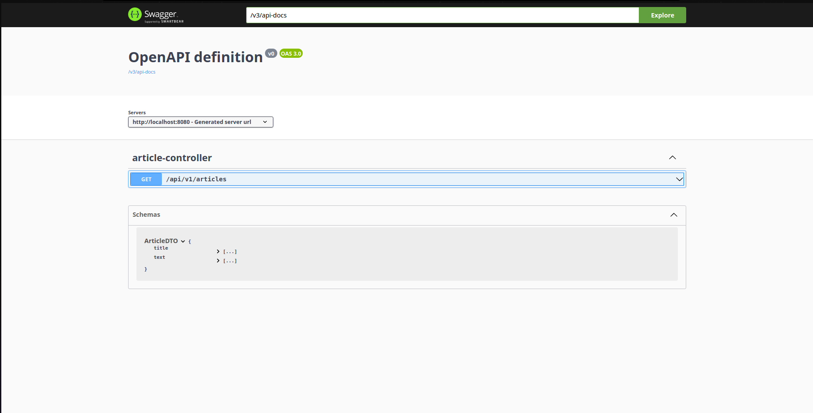
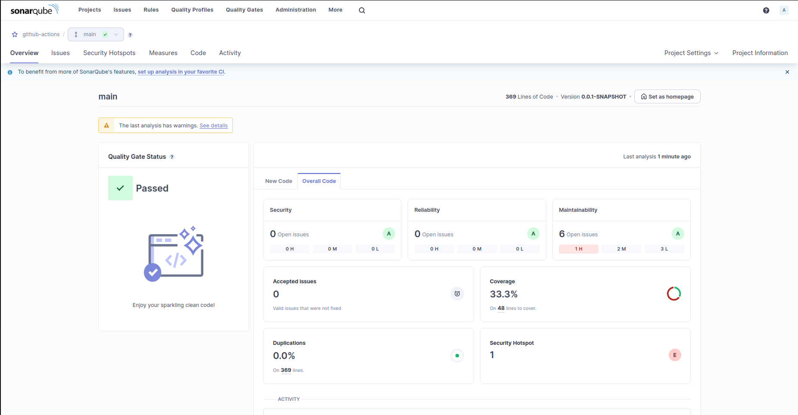
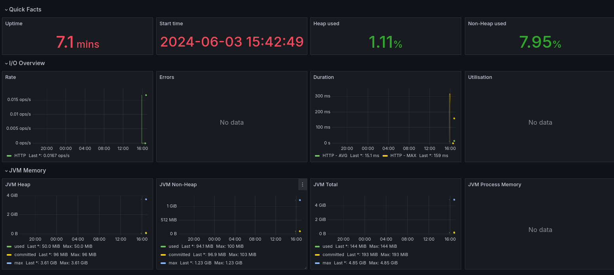

# Простое Spring приложение с использованием CI/CD, проверки покрытия кода тестами и мониторинга

Проект для закрепления материала по CI/CD, полностью покрытый тестами с мониторингом.


## Требования

* Open JDK 17
* Apache Maven 3.8

## Запуск 

Перед запуском необходимо **настроить переменные окружения** в .env.

### Docker Compose

Сначала скомпилируем наше приложение в .jar для построение образа нашего приложения:

```bash
mvn clean package
```

Для запуска приложения с помощью Docker:

```bash
docker compose up -d
```

## Routes



Для отображения Swagger необходимо пройти по **localhost:8080/swagger-ui/index.html**.

## Тестирование

Все тесты находятся в src/test. Тестирование с помощью JUnit и Mockito. Тестируются только **service** и **controller** пакеты.

Для **запуска** тестов:

```bash
mvn clean test
```

Для отображения покрытия тестов с помощью JaCoCo:

```bash
mvn clean verify jacoco:report
open target/site/jacoco/index.html
```


Для более красивого и подробного покрытия кода используется SonarQube:

```bash
mvn sonar:sonar
```

SonarQube находится на localhost:9000. Необходимо авторизоваться в сервисе:

**login**=admin

**password**=admin

После этого вас попросят поменять пароль.



## CI/CD

Всю информацию о джобах можно найти в .github/workflows.

При пуше в *develop* запускаются стандартные проверки джобы на build, test и coverage. Coverage должен составлять **не менее 80%**. Этот параметр можно поменять в pom.xml.

При пуше в *release* ко всем джобам выше добавляется deploy на dockerhub. В Github Actions **необходимо настроить секреты** DOCKERHUB_USERNAME, DOCKERHUB_TOKEN для успешного деплоя.

## Мониторинг

Для мониторинга используются **Victoria Metrics, Prometheus & Grafana**.

Для начала необходимо установить [Grafana Server](https://github.com/VictoriaMetrics/VictoriaMetrics/releases/tag/v1.101.0) и [Victoria Metrics](https://grafana.com/grafana/download).

### Запуск Victoria Metrics:

Необходимо запустить Victoria Metrics с конфигом, который находится в victoriametrics/scrape.yml:

```bash
./victoria-metrics-prod -promscrape.config={PATH_TO_PROJECT}/victoriametrics/scrape.yml
```
Victoria Metrics откроется на порту 8428.

### Запуск Grafana Server:

```bash
./grafana-server
```

Grafana откроется на 3000 порту. В разделе "Datasources" необходимо добавить Prometheus, в разделе url указать **http://localhost:8428** (то есть до Victoria Metrics). Далее можно импортировать различные дашборды, для удобства они есть в моем репозитории /grafana/*.json.



Так же можно написать собственные панели для дашборда:


